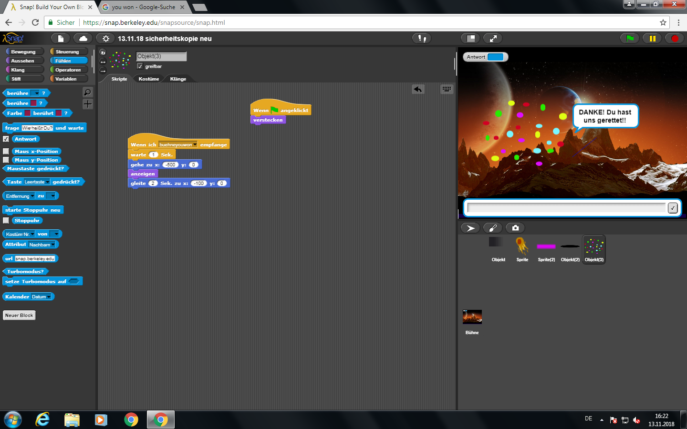

# PROJEKT  INFORMATIK (*"Planet vs. Komet"*)

# Inhalt
[1. Einleitung](#1)

[2. Einfindung in das Programm](#2)

[3. Unser Projekt](#3)

[4. Fazit und Zusammenfassung](#4)

[5. Quellen](#5)

[6. Alles zum Spiel](#6)

# Einleitung
In diesem Blog haben wir die Entwicklung unseres Informatikprojekts dokumentiert. Dazu gehören sowohl die Informatikstunden, in denen wir an unserem Projekt gearbeitet haben, als auch die Zeit welche wir außerhalb der Schule dafür investiert haben. Schlussendlich ist eine Chronologie entstanden, welche die Entwicklung des Spiels mit Progression und Rückschlägen so nachvollziehbar wie möglich darstellt. Also viel Spaß beim Lesen!

# Einfindung in das Programm 

## 21.08.2018 15 Uhr
### Einführungsstunde (Stunde 1)
Als aller erstes haben wir uns eine gemeinsame Emailadresse bei Googlemail erstellt, 
um uns damit beide jederzeit bei Github anmelden zu können.
Wir haben uns in Herrn Buhls Dokument auf Github über die verschiedenen Programme und Möglichkeiten informiert um zu entscheiden,
mit welchem wir unser erstes Projekt starten wollen. Wir haben uns länger mit Starlogo TNG beschäftigt,
fanden dann aber "The Beauty and Joy of Computing" (beziehungsweise "Snap!") am spannensten. Den Rest der Stunde haben wir das Programm erforscht.

## 25.08.2018 
### Victoria
Um mich mehr in das programmieren einzufinden, habe ich mir zu Hause Starlogo TNG heruntergeladen und eineinhalb 
Stunden mit verschiedenen Befehlen und Figuren herumexperimentiert. Ich habe verschiedene Kombinationenen von Befehlen ausprobiert um
herauszufinden, wie sich die Figuren, in meinem Fall 2 Schildkröten, dementsprechend verhalten.

## 26.08.2018 
### Johanna
Ich habe mich Zuhause anderthalb Stunden mit "Snap!" beschäftigt und eigene Figuren gezeichnet. 
Die Figuren habe ich bewegen und reden lassen. Außerdem haben sie auf mehrere Fragen geantwortet. Ich war
schon stolz, dass ich das geschafft habe. 

## 27.08.2018
### Zeichnen (Stunde 2)
Um uns noch besser mit dem Programm vertraut zu machen, haben wir uns in der Stunde mit einem kleinen Projekt beschäftigt. 
Wir haben einen Schneemann (mit dem Namen Vicci-Jo Man) gemalt und ihn auf einem Berg herum laufen lassen. Außerdem hat er seinen Arm bewegt und sich mit uns unterhalten. Zuerst hat er uns gefragt wie wir heißen, dann unseren Namen bewundert und uns nach unserer Meinung über das Wetter gefragt.
Am Ende der Stunde haben wir es nicht gespeichert, da es nur eine Übung war und nicht unser richtiges Projekt. Wir haben aber einen Screenshot gemacht.

 
 
## 28.08.2018 
### Unser Blog (Stunde 3)
In der heutigen Stunde haben wir uns weniger mit dem Spiel beschäftigt, dafür mehr mit dem Blog. Wir haben uns ein wenig eingearbeitet und schließlich auch ein paar Screenshots hochgeladen um diese dann hier auch einfügen zu können. Mehr ist heute aber nicht wirklich passiert, da das internet auch auf einmal nicht mehr ging. Zwischendurch haben wir unsere Internetseite mehrmals geupdatet, damit wir wieder auf unseren Blog zugreifen konnten.

## 02.09.2018
### Experimentieren Victoria
Heute habe ich mich erneut zu Hause an unser gemeinsames Projekt gesetzt und mit dem Programm experimentiert.
Diesesmal habe ich versucht einen Stift eine bestimmte Linie zeichnen zu lassen. Den Stift, bzw. das Kostüm, 
habe ich heute erst gefunden, nachdem ich mir das Programm näher angesehen und eine große Auswahl an 
verschiedenen Kostümen bei der Suche gefunden hatte. Ich habe eine Reihe von Befehlen zusammengestellt 
und zu meiner Überraschung hat es tatsächlich funktioniert, aber ich hatte auch ein wenig Zuversicht, dass
es klappen würde.

Nachdem ich mich dann mit den Befehlen weiterhin auseinandergesetzt habe, habe ich die Befehle so zusammengestellt, dass die Sprite nun eine bestimmt Form mit dem Stift zeichnet, in diesem Fall ein Dreieck. 

## 02.09.2018
### Johanna (Brüder befragen)
Vicci und Ich hatten beschlossen, dass wir gerne ein Spiel kreieren wollten, da uns dieses Projekt am sinnvollsten, spannensten aber auch für den Anfang am anspruchvollsten vorkam. Da wir uns über die genaue Gestaltung des Spiels aber noch unsicher waren, habe ich Zuhause meine jüngeren Brüder dazu befragt, was sie in ihrer Freizeit gerne für Spiele spielen und was ihnen dabei am wichtigsten ist. Die Ergebnisse sind noch genauer in der Einleitung unseres zweiten Blocks zu lesen aber grob zusammen gefasst lässt sich sagen, dass die Hintergrundgeschichte des Spiels sowie die Möglichkeiten der Interaktion die wichtigsten Kriterien darstellten. Das Thema, was meine Brüder am spannensten und am besten geeignet fanden, war der Weltraum beziehungsweise das Universum. Daraufhin habe ich mich mit Vicci darauf geinigt, dass wir das Spiel um ein Flugzeug herum kreiren wollen, welches mit dem Spieler den Weltraum entdeckt. Genauere Details standen aber noch nicht fest.

## 03.09.2018
### Stunde 4
Wir haben heute bei Snap! Build your own block 4.2.1.4. einen Account eröffnet, um unser Projekt speichern zu können. Außerdem haben wir versucht heraus zu finden, wie man ein Projekt spielen kann, ohne dass man sich auf dem Account bei Snap anmelden muss. Leider schien das nicht möglich zu sein und auch Herr Buhl war der Meinung, dass wir ihm am Ende, wenn wir das Projekt abgeben wollen, einfach die Login Daten von unserem Account geben sollen. Wir fanden es schade, dass es diese Möglichkeit nicht gibt, da wir ja auch beispielsweise unsere Geschwister oder Freunde das fertige Spiel spielen lassen wollen, ohne dass man sich jedes Mal in den Account anmelden muss. Trotzdem haben wir uns überlegt, dass wir unser erstes Projekt mit Snap gestalten wollen, da es ja nicht das Letzte ist und wir bei den darauf folgenden ja noch andere Programme ausprobieren können.

## 04.09.2018
### Stunde 5
In dieser Stunde haben wir uns kurz mit dem Spiel beschäftigt, wollten danach aber lieber den Blog schöner gestalten. Deshalb haben wir uns die Blogs von Klassen angeschaut, die vor uns bereits ein Projekt geamcht haben und geschaut welche besonderen Elemente sie verwendet haben und wie sie beispielsweise die Überschriften groß gemacht und Links eingefügt haben. Einige dieser Elemente haben wir dann auch bei uns angewendet und unseren Blog auf den neusten Stand gebracht. 

## 10.09.2018
### Stunde 6
Um unsere Idee in die Tat umzusetzten, haben wir uns erstmal darum gekümmert ein passendes Kostüm zu kreieren. Zeichnen bei Snap kam nicht infrage, da auf dem Computer das Zeichnen von so genaue Linien und Konturen die wir uns für unsere "Hauptfigur" gewünscht haben, nicht möglich ist. Danach haben wir bei den vorhandenen Kostümen auf Snap! gestöbert doch da haben wir keins gefunden mit dem wir komplett zufrieden waren. Also haben wir im Internet nach Bildern und Animationen geguckt da wir herausgefunden haben, dass man auch Kostüme in Form von Bildern importieren kann. Nach einiger Zeit haben wir dann ein Flugzeug gefunden, was uns beiden gefiel. Wir hatten außerdem herausgefunden, dass man die Datei zuerst herunterladen muss, um sie zu importieren. Das taten wir dann auch und wir hatten unser 1. Kostüm damit fertig. Wir haben noch die Größe angepasst und es passend ausgeschnitten. Unser wichtigstes Element ist also in dieser Stunde fertig geworden!

# Unser Projekt

## 11.09.2018
### Animation Weltkarte (Stunde 7)

Unsere erste Idee war es, das Bermudadreieck auf einer Karte von einem Flugzeug kennzeichnen zu lassen woraufhin das Flugzeug 
abstürzt und in den Weltraum gesogen wird. Allerdings war uns diese Idee zu wenig interaktiv, deshalb mussten wir uns etwas neues überlegen. 
Wir haben mithilfe von Google Earth den Hintergrund zu einer Weltkarte geändert. Daraufhin haben wir unser Flugzeug so programmiert, dass es endlos um die ganze Welt fliegt und sich währenddessen mit dem Spieler unterhält.
Es hat erzählt wie es heißt und dann den Spieler eingeladen, mit ihm zusammen die Welt zu retten.
Unser Problem lag in dieser Stunde darin, dass die Flugzeuganimation zu groß war aber sobald man sie verkleinerte in ihren Konturen verschwamm. Außerdem war es uns nicht möglich, dass Flugzeug bedeutend langsamer fliegen zu lassen.

## 17.09.2018
### Zwei Welten Stunde 8
In der heutigen Doppelstunde, war ich (Victoria) alleine, da Jojo einen Arzttermin hatte. Ich habe mich mit unserem Projekt befasst und das Spiel weiter bearbeitet. Ich habe eine zweite Bühne hinzugefügt (ein neuer Planet), welcher das erste Level des Spiels darstellen wird. Ich habe dem Flugzeug Befehle gegeben, nach denen er über die Bühne fliegt und den Spieler zu den "Abenteuern" leitet.
Das Flugzeug begleitet den Spieler durch das Spiel und interargiert auch mit ihm.

## 18.09.2018
### The game (Stunde 9)
In dieser Stunde haben wir eine genaue Skizze unserer Spielidee gezeichnet und uns überlegt, was der Sinn des Spiels ist und welche Elemente im Spiel vorkommen sollen. Wir haben uns für ein Spiel entschieden, was wir in ähnlichen Varianten schon früher gerne ab und zu gespielt haben. Das Spiel funktioniert so, dass es einen Gegenstand (meistens kugelförmig) gibt, welcher an den Rändern abprallt und über den Monitor fliegt. Mithilfe eines Elements am unteren Bildschirmrand muss man dann versuchen den Gegenstand davon abzuhalten, den Boden zu berühren, sonst ist das Spiel verloren. 
Für dieses Spielmodell haben wir uns entschieden, da es für den Spieler auch ohne viele Erklärungen relativ simple zu verstehen ist und trotzdem einen lustigen Zeitvertreib darstellt. 
Als Gegenstand haben wir uns überlegt, eine potentielle Gefahr zu erstellen, die der Spieler mithilfe eines Balkens aufhalten muss. Dadurch wollten wir dem Spiel noch einen "tieferen Sinn" geben (ob es so etwas wie einen tieferen Sinn bei einem Online Spiel überhaupt gibt, darüber lässt sich streiten :D ), indem man den Gegenstand aufgrund eines bestimmten Zwecks davon abhält, den Boden zu berühren.

## 19.10.2018
### Informatik Ferien 
Am Ende der Ferien waren wir so motiviert, dass wir haben uns zum arbeiten getroffen. Wir haben versucht Snap auf Johannas Laptop zu öffnen, allerdings ist der etwas in die Jahre gekommene Laptop jedes Mal erneut abgestürzt. Deshalb haben wir uns schlussendlich mit unserem Github Blog beschäftigt und einen Plan zur weiteren Vorgehensweise unser Spiel betreffend ausgearbeitet. Im Endefekt ein äußert produktiver und gut investierter Ferientag. 

## 22.10.2018
### Planetenwechsel und Kommunikation zwischen Bühne und Sprite (Stunde 10)
In dieser Stunde haben wir nach Vorschlag von Herrn Buhl unsere Befehle überarbeitet und überflüssige Operatoren entfernt. Daraufhin haben wir uns mit der Kommunikation zwischen verschiedenen Objekten innerhalb des Programms beschäftigt. Herr Buhl hat uns erklärt, dass Objekte in Form eines Befehls Nachrichten senden und empfangen können. Dieses Prinzip haben wir nun auch in unserem Spiel umgesetzt. Nun sendet unser Flugzeug eine Nachricht an die Hintergründe, wenn es mit der Kommunikation mit dem Spieler fertig und bereit zur Weiterreise ist. Wenn die Bühnen diesen Befehl erhalten, wechselt die Bühne von der Erde zum anderen Planeten und die Reise nimmt ihren Lauf. To be continued.... 

## 23.10.2018
### Stunde 11
Nachdem wir gestern den Bühnenwchsel hinbekommen haben, haben wir uns nun mit dem Spiel befasst. Dazu haben wir um Internet nach guten Hintergründen gesucht. Als wir einen gefunde hatten haben wir wieder den Befehl eingebaut, die Bühne zu wechseln und somit war die Grundlage schonmal gelegt. Als nächsten Schritt wollten wir als Spielgegenstand eine zum Thema passende Sprite erstellen. Dann hatten wir die Idee einen Meteoriten zu malen und diesen als Kostüm zu nutzten. Also machten wir uns an die Arbeit. Leider war die Zeit nicht lang genug und wir hatten ihn nicht fertig bekommen. Aber wir haben das Vorhaben dann einfach auf nächste Woche verlegt.

## 29.10.2018
### Metheory ist geboren (Stunde 12)
Let us celebrate today as the day where the one and only Metheory saw the light of life. Metheory ist ein selbstgezeichneter Meteorid der in unserem Spiel eine bedeutende Rolle einnimmt. Ebenfalls haben wir einen roten Strich als neue Sprite erschaffen, der in der Lage ist, den Meteor davon abzuhalten, den Boden zu berühren. Dieser rote Strich folgt der X-Position der Maus, bleibt dabei aber in seiner Y-Position. Da wir einige Schwierigkeiten mit den Befehlen hatten, haben wir Herrn Buhl gefragt. ER hat uns erklärt, dass wir nicht alle Kostüme mit nur einem Skript programmieren können, sonder für jedes Kostüm ein eigenes machen müssen damit es funktioniert. Daran hatten wir die ganze zZeit gar nicht gedacht und haben darauf gleich damit ungefangen seinen Ratschlag umzusetzen.

## 30.10.2018
### Everything for nothing? (Stunde 13)
Heute war ein nicht so guter Tag für uns... Es war der schlechteste Tag in unserer Informatikgeschichte (since day 1). Zuerst haben wir den Computer nicht anbekommen... Dann konnte Snap! unser Projekt nicht öffnen, aus für uns unergründlichen Gründen. Nach mehreren Versuchen konnten wir glücklicherweise das Projekt recovern, allerdings in der Version vom 22.10.2018. Nun haben wir erstmal zwei Sicherheitskopien des Projekts gemacht, um sicherzugehen, dass das Spiel nicht wieder verschwindet. Wir mussten nun die Arbeit des Vortages wiederholen und haben das Spiel weiterentwickelt. Dabei hat jede Sprite ein eigenes Skript bekommen, da wir vorher alles in einem Skript hatten. Nachdem wir alles erneut gespeichert hatten, wollten wir es ein letztes mal in der Stunde öffnen und mussten mit Erschrecken feststellen, dass alle Sicherheitskopien sowie das Original erneut nicht abrufbar waren. Wir mussten uns damit abfinden, dass all unsere bis jetzt geleistete Arbeit umsonst gewesen war :(

## 04.11.2018
### Glück im Unglück 
Als ich heute an meinem Computer gearbeitet habe, ist mir plötzlich aufgefallen, dass ich noch ein Fenster von Snap! offen hatte. Als ich darauf ging war ich sehr erleichtert da ich gesehen habe, dass ich noch eine alte Version des Spiel geöffnet hatte und Gott sei Dank beim letzten bearbeiten zu Hause geschlossen hatte. Ich habe diese Version also mehrmals unter verschiedenen Namen gespeichert und hoffte, dass wenn wir das nächste mal im Unterricht sitzen, diese öffnen können um weiter daran zu arbeiten anstatt alles nochmal neu zu programmieren.

## 05.11.2018
### Stunde 14
In der Hoffnung, dass das Speichern des Spiels bei mir (Victoria) funktioniert hat, haben wir in der heutigen Montagsstunde den Computer angeschaltet und dazu unserer Zufriedenheit festgestellt, das das Spiel wieder zu öffnen war. Es hat also geklappt und wir müssen nicht nochmal von Vorne anfangen. Wir haben das Spiel ein paar Mal durchlaufen lassen um zu sehen, auf welchem Stand der Dinge das Spiel war (da es ja nicht die aktuellste Version des Spiel war, die zu Hause gespeichert wurde). Aber an diesem Tag haben wir nichts großartig verändert, sondern waren eher damit beschäftigt es auf den Stand zu bringen, in dem es letzte Stunde war.

## 06.11.2018
### Stunde 15
Die heutige Doppelstunde haben wir hauptsächlich wieder damit verbracht unser Spiel auf den ursprünglichen Stand zu bringen. Nachdem wir dachten, dass es wieder hergestellt war machten wir uns an die Arbeit nun endlich das Spiel weiterzuentwickeln. Dies beinhaltete den Befehl zu "Bouncen". Wir wollten, dass die Sprite bei einem Hinderniss davon abprallt, doch dies hat einfach nicht funktioniert. Dann war die Zeit auch schon vorbei und wir mussten unsere weiteren Vorhaben auf die nächste Stunde verschieben. 

## 12.11.2018
### Stunde 16
Die heutige Stunde war erneut ein Erfolg für uns. Durch die Hilfe von Herrn Buhl haben wir es geschafft, das unser Meteor bei dem Hinderniss "bouncet". Somit sind wir bei unserem Spiel ein ganzes Stück weitergekommen und haben das, was wir vergeblich in den letzten 2 Stunden versucht haben endlich geschafft. Außerdem konnten wir die Sprite so programmieren, dass sie nun auch vom Rand abprallt. Mit diesen 2 Schritten haben wir also heute einen großen Vorschritt erzielt. (Wie genau wir das gelöst haben kann man in unserem 2. Blog nachlesen, der Link ist unten bei "Alles zum Spiel" zu finden oder oben in der Gliederung.)- er hat uns heholfen

## 13.11.2018
### Stunde 17
Auch der heutige Tag brachte Erfolge. Wir haben viele Ideen bekommen, wie wir unser Spiel vollenden können. Schlussendlich haben wir uns dafür entschieden, dass am Ende ein schwarzes Loch den Meteor aufsaugt, wenn das Spiel gewonnen ist. Außerdem fliegt der Begleiter, das Flugzeug ins Bild mit Konfeti und gratuliert dem Spieler zu seinem Sieg. Wenn aber das Spiel verloren wird, dann explodiert die Welt und das Spiel ist vorbei. Weiterhin aber begleitet das Flugzeug den Spieler, doch es gibt noch einige komplikationen bei dem Szenario "verloren". Es gibt noch einige Kleinigkeiten die wir verbessern aber im großen und ganzen sind wir schon sehr zufrieden mit unserem Spiel.

## 15.11.2018
### Victoria
Da wir noch einige Kleinigkeiten an dem Spiel verfeinern wollen hab ich mich heute Nachmittag erneut mit dem Programm auseinandergesetzt. Ich habe versucht einen kleinen Fehler zu beheben, welchen wir in der letzten Informatikstunde nicht finden konnten. Nach einer Zeit habe ich es hinbekommen. Doch wir haben noch ein zweites Problem, welches ich bis jetzt noch nicht lösen konnte. Außerdem beschäftige ich mich noch mit unserem Blog hier auf Github. Mit einigen Verschönerungen möchte ich diesen Blog nun fast zu Ende bringen. Ich habe ein Inhaltsverzeichnis erstellt und ein paar Inhalte der letzten Stunden hinzugefügt. Außerdem habe ich noch ein paar Inhaltliche Punkte ergänzt (Einleitung, Fazit). Zudem habe ich auch versucht unseren Prozess auf dem Programm inhaltlich zu gliedern, sodass man weiß was zum wirklichen Projekt gehört und was nicht (Einfindungsphase und Projekt). 

## 18.11.2018
### Victoria
An diesem Sonntag Nachmittag wollte ich wieder ein wenig an unserem Blog arbeiten. Ich habe noch einige Tage überarbeitet und haber noch ein wenig zu unserem Spielblog hinzugefügt. 

## 19.11.2018
### Johanna (finale Überarbeitungen)
Ich habe mich mit dem weitern Schreiben der beiden Github Blöcke beschäftigt und die fertigen Resultate noch einmal überarbeitet. Ich habe an beiden Blöcken weiter geschrieben und unsere Intention sowie den Sinn des Spiels beschrieben. Außerdem habe ich das Fazit geschrieben und noch Bilder eingefügt. Leider funktioniert an meinem Laptop das Programm Snap! immer noch nicht, obwohl alle Computerprogramme und Windows auf dem neuesten Stand sind (das Computermodell allerdings leider eher nicht). 

## 20.11.2018
### Die letzte Stunde (Stunde 18)
In der letzten Informatikstunde vor der Abgabe habe ich mich nochmal kurz mit Johanna an unser Problem gesetzt, dass das Flugzeug den Befehl im Fall verlieren nicht ausführt. Da wir dem Problem bis heute nicht genau auf den Grunde gehen konnten, haben wir Herrn Buhl nach seiner Meinung gefragt. Wir haben uns dann kurz zusammengesetzt und etwas herumexperimentiert. Schließlich haben wir festgestellt das es daran lag, dass ein paar Befehle an der falschen Stelle waren. nach ein paar Änderungen aber hat es endlich geklappt.

# Fazit und Zusammenfassung
Dieser Blog hier soll dazu dienen unsere Schritte zu dem finalen Projekt verständlich zu machen. Etwas weniger als 3 Monate hatten wir für unser aller erstes Prjekt Zeit und es war eine sehr interessante Zeit, in der wir viel neues und spannendes gelernt haben. Da wir beide vor dem Informatikunterricht nicht wirklich mit Computern gearbeitet haben, war das alles Neuland für uns. Doch nach nicht allzu langer zeit hat man sich gut einarbeiten können und als wir die Grundlagen verstanden haben, hat es sogar angefangen richtig Spaß zu machen. Auch das Programm Snap! (https://snap.berkeley.edu/snapsource/snap.html), welches wir ausgewählt haben um unser Spiel zu programmieren war wirklich anfängerfreundlich und relativ leicht zu bedienen. Glücklicherweise ist es uns auch gelungen, das Spiel so zu gestalten und zu programmieren wie wir uns das vorgestellt hatten. Da  in dem ausgwählten Programm alle nötigen Befehle sowie die Möglichkeiten des Imports von Bildern und Animationen vorhanden sind, waren unserer Phantasie keine Grenzen gesetzt. Herr Buhl hat uns keine genauen Vorgaben zur genauen Art des Projekts gemacht und die Möglichkeiten reichten von komplexen Zeichnungen, welche wir auf der Website von "The Joy and Beauty of Computing" gesehen haben, bis hin zu richtigen Spielen mit Animationen. Die vielen Möglichkeiten haben die Entscheidung nicht unbedingt vereinfacht, aber wir haben uns dann schon relativ früh für ein Spiel entschieden. Dieses dann mit Befehlen zusammen zu setzen und nach unseren Vorstellungen zu programmieren hat schlussendlich sehr viel Spaß gemacht. Außerdem war der Informatikunterricht eine willkommene Abwechslung zum regulären Unterricht, der häufig bedeutend weniger abwechslungsreich verläuft. 
Herr Buhl hat uns in der 1. Stunde erzählt, dass einige Schüler durch den Informatikunterricht die Freude am programmieren gefunden haben und mittlerweile können wir auch verstehen, warum. Beim Programmieren kann man seiner Kreativität freien Lauf lassen und sich auch künstlerisch ausleben. Diese Faktoren stellen einen großen Teil des Reizes vom Programmieren dar, da praktisch alles möglich ist (mit genügend Erfahrung natürlich, von der wir leider noch meilenweit entfernt sind :D) 
Wir müssen zugeben, dass es anfänglich oft frustrierend war, dass Herr Buhl uns wenig Hilfestellung gegeben hat, da wir noch keinerlei Vorkenntnisse im Bezug auf das Programmieren und Informatik hatten. Später hat sich dann allerdings heraus gestellt, dass wir durch das eigene Erarbeiten, Probieren und Versuchen wesentlich tiefer in die Thematik eingestiegen sind, als es vermutlich mit festen Vorgaben der Fall gewesen wäre. Die anfänglich für Verwirrung sorgende Lehrmethode hat uns also schlussendlich doch überzeugt. Bei aufkommenden Fragen und Problemen konnten wir uns glücklicher Weise während des Projekts auch an Herrn Buhl wenden, der uns dann weitergeholfen und unterstüzt hat.
Wir sind sehr zufrieden mit dem Ergebnis dieses Projekts und freuen uns schon auf die nächsten Projekte!
(Genaue Informationen zu unserem Spiel findet ihr auf unseren anderen Blog auf Github.)

# Quellen

- https://snap.berkeley.edu/snapsource/snap.html

- https://github.com/viccianna/InformatikUnterricht

- https://www.keinblatt.de/blog/?tag=explosion (Bild)

# Alles zum Spiel

Hier findet ihr unseren 2. Blog in dem wir die Programmierung unseres Spiels Schritt für Schritt erklären.
Viel Spaß beim Nachmachen!

https://github.com/viccianna/BLOG
