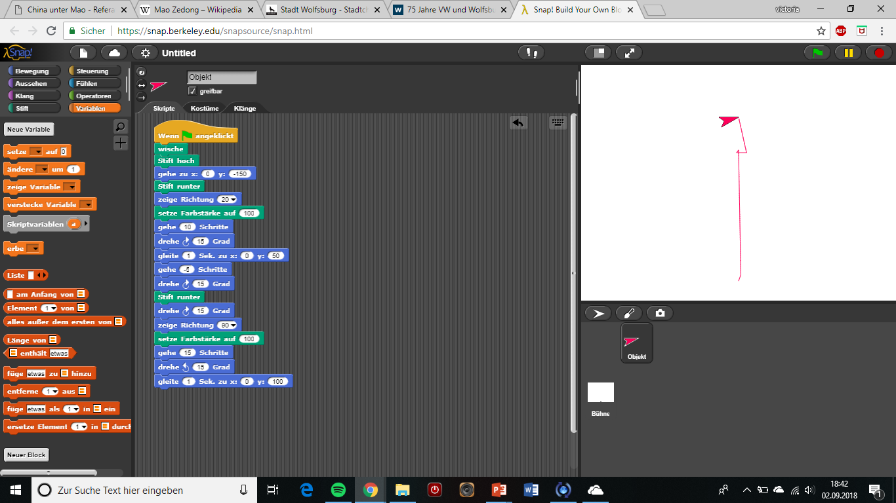
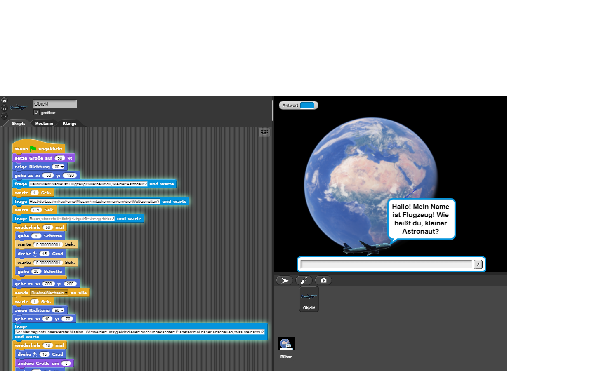

# project-1

## 21.08.2018 15 Uhr
### Einführungsstunde
Als aller erstes haben wir uns eine gemeinsame Emailadresse bei Googlemail erstellt, 
um uns damit beide jederzeit bei Github anmelden zu können.
Wir haben uns in Herrn Buhls Dokument auf Github über die verschiedenen Programme und Möglichkeiten informiert um zu entscheiden,
mit welchem wir unser erstes Projekt starten wollen. Wir haben uns länger mit Starlogo TNG beschäftigt,
fanden dann aber "The Beauty and Joy of Computing" am spannensten. Den Rest der Stunde haben wir das Programm erforscht.

## 25.08.2018 Victoria
Um mich mehr in das programmieren einzufinden, habe ich mir zu Hause Starlogo TNG heruntergeladen und eineinhalb 
Stunden mit verschiedenen Befehlen und Figuren herumexperimentiert. Ich habe verschiedene Kombinationenen von Befehlen ausprobiert um
herauszufinden, wie sich die Figuren, in meinem Fall 2 Schildkröten, dementsprechend verhält.

## 26.08.2018 Johanna
Ich habe mich Zuhause anderthalb Stunden mit TBaJoC beschäftigt und eigene Figuren gezeichnet. 
Die Figuren habe ich sich bewegen und reden lassen. Außerdem haben sie auf mehrere Fragen geantwortet. Ich war
schon stolz, dass ich das geschafft habe. 

## 27.08.2018
### Zeichnen
Um uns noch besser mit dem Programm vertraut zu machen, haben wir uns in der Stunde mit einem kleinen Projekt beschäftigt. 
Wir haben einen Schneemann (mit dem Namen Vicci Jo Man) gemalt und ihn auf einem Berg herum laufen lassen. Außerdem hat er seinen
Arm bewegt und sich mit uns unterhalten. Zuerst hat er uns gefragt wie wir heißen, dann unseren Namen bewundert und uns nach unserer Meinung über das Wetter gefragt.
Am Ende der Stunde haben wir es nicht gespeichert, da es nur eine Übung war und nicht unser richtiges Projekt. Wir haben aber einen Screenshot gemacht.

 
 
 ## 28.08.2018
 ### Illuminati
 Heute am Illuminati Tag habenm wir uns um unsere Internet Präsenz gekümmert. Wir haben den GitHub Block gekümmert und gelernt 
 wie man Screensgotts einfügt und den Olymp besteigt. Außerdem haben wir Mozilla Firefox installiert und so etwas gutes für die Schule getan.

## 02.09.2018
### Experimentieren Victoria
Heute habe ich mich erneut zu Hause an unser gemeinsames Project gesetzt und mit dem Programm experimentiert.
Diesesmal habe ich versucht einen Stift eine bestimmte Linie zeichnen zu lassen. Den Stift, bzw. das Kostüm, 
habe ich heute erst gefunden, nachdem ich mir das Programm näher angesehen und eine große Auswahl an 
verschiedenen Kostümen bei der Suche gefunden hatte. Ich habe eine Reihe von Befehlen zusammengestellt 
und zu meiner Überraschung hat es tatsächlich funktioniert, aber ich hatte auch ein wenig Zuversicht, dass
es klappen würde.

## 11.09.2018
### Animation Weltkarte

Wir haben heute bei Snap! Build your own block 4.2.1.4. einen Account eröffnet, um unser Projekt speichern zu können. 
Unsere erste Idee war es, das Bermudadreieck auf einer Karte von einem Flugzeug kennzeichnen zu lassen woraufhin das Flugzeug 
abstürzt. Allerdings war uns diese Idee zu wenig interaktiv, deshalb mussten wir uns etwas neues überlegen. 
Wir haben mithilfe von Google Earth den Hintergrund zu einer Weltkarte geändert. Daraufhin haben wir aus einer Flugzeugbild das Flugzeug ausgeschnitten und es so programmiert, dass es endlos um die ganze Welt fliegt und sich währenddessen mit dem Spieler unterhält.
Es hat erzählt wie es heißt und dann den Spieler eingeladen, mit ihm zusammen die Welt zu retten.
Unser Problem lag in dieser Stunde darin, dass die Flugzeuganimation zu groß war aber sobald man sie verkleinerte in ihren Konturen verschwamm. Außerdem war es nicht möglich,dass Flugzeug bedeutend langsamer fliegen zu lassen.

## 25.09.2018
### Zwei Welten
In der heutigen Doppelstunde, war ich alleine, da Johanna einen Termin hatte. Ich habe mich mit unserem Projekt befasst und das Spiel weiter bearbeitet. Ich habe eine zweite Bühne hinzugefügt (ein neuer Planet), welcher das erste Level des Spiels darstellen wird.
Das Flugzeug begleitet den Spieler durch das Spiel und interargiert auch mit ihm.

## 19.10.2018
### Informatik Ferien 
Am Ende der Ferien waren wir so motiviert, dass wir haben uns zum arbeiten getroffen. Wir haben versucht Snap auf Johannas Laptop zu öffnen, allerdings ist der etwas in die Jahre gekommene Laptop jedes Mal erneut abgestürzt. Deshalb haben wir uns schlussendlich mit unserem Github Blog beschäftigt und einen Plan zur weiteren Vorgehensweise unser Spiel betreffend ausgearbeitet. Im Endefekt ein äußert produktiver und gut investierter Ferientag. 

## 22.10.2018
### Planetenwechsel und Kommunikation zwischen Bühne und Sprite
In dieser Stunde haben wir nach Vorschlag von Hernn Buhl unsere Befehle überarbeitet und überflüssige Operatoren entfernt. Daraufhin haben wir uns mit der Kommunikation zwischen verschiedenen Objekten innerhalb des Programms beschäftigt. Herr Buhl hat uns erklärt, dass Objekte in Form eines Befehls Nachrichten senden und empfangen können. Dieses Prinzip haben wir nun auch in unserem Spiel umgesetzt. Nun sendet unser Flugzeug eine Nachricht an die Hintergründe, wenn es mit der Kommunikation mit dem Spieler fertig und bereit zur Weiterreise ist. Wenn die Bühnen diesen Befehl erhalten, wechselt die Bühne von der Erde zum anderen Planeten und die Reise nimmt ihren Lauf. To be continued.... 

